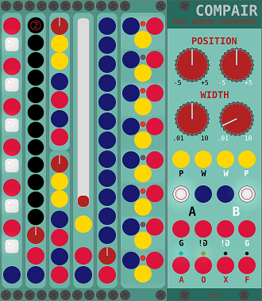

<!-- Version and License Badges -->

... is a set of [VCVRack](https://www.vcvrack.com) modules created mainly for my own use.
Most are modified and/or slimmified versions of others or just simple tools/toys
i wanted to have and enjoyed learning to program.

## Disclaimer

I'm new to the modular synthesis world, new to programming, new to github.  
**... expect bugs, beginner mistakes, etc.**

[Any and all feedback is welcome.](https://github.com/phdsg/PvC/issues)

## Thanks

First of all: Andrew Belt for making VCVRack and making it open source.  
Strum: his modules and encouragement made me start this whole programming trip.  
All the other module developers for their inspiring modules.

## List of Modules

  
  
    
    

  [ComPair](compair.md)  
  [Mu\[L\]ty](multy.md)  
  [Oomph](oomph.md)  
  [ShutIt](shutit.md)  
  [SumIt](sumit.md)  
  [vAMPs](vamps.md)  
  [VUBar](vubar.md)  
  [...](plans.md)
    
    
    
    
    
    
    
    
    
## Build Instructions

  To build the modules from source you first have to build rack from sources as described here:  
    (link to tutorial)  

  Then clone this repository into rack's plugins folder.  
    `$ cd plugins && git clone https://github.com/phdsg/PvC`  
    
  Change directory to PvC and use make to build the plugin.  
    `$ cd PvC && make`  
  
## Contact & Help
I'm almost always online @ #VCVRack (irc.freenode.net). Other module devs are too!  
Also, the [issue tracker](https://github.com/phdsg/PvC/issues) can be used for all questions.

