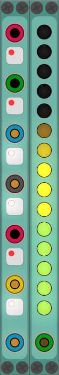

<!-- Version and License Badges -->

# PvC Modules for VCVRack

... is set of [VCVRack](https://www.vcvrack.com) modules created mainly for my own use.  
Most of them are modified and/or slimmified versions of others or  
just simple tools/toys i wanted to have and enjoyed learning to program them.

I'm new to the modular synthesis world, new to programming, new to github.  
**... expect bugs, beginner mistakes, etc.**

[Any and all feedback is welcome.](https://github.com/phdsg/PvC/issues)

## List of Modules

## How-To

### Build Instructions

### Module Manuals

### Example-Patches

## Contact & Help
I'm almost always online @ #VCVRack (irc.freenode.net). Other module devs are too!  
Also, the [issue tracker](https://github.com/phdsg/PvC/issues) can be used for all questions.

## Support PvC
"Buy" a copy of the modules from my [gumroad](https://gumroad.com/l/kXPIO) account for 0+ bucks ;)
