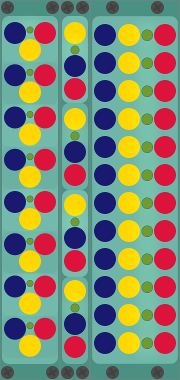

# Shutters 
... is a set of mute switches (replaces [MuLty](multy.md))  
 (3 varieties: ShutIt, ShutItSlim, ShutItXL)  
 
## Details
ShutIt has 8 channels (Slim: 4, XL: 12) that can be individually muted using a remote trigger signal or by clicking the panel.
Each input carries the signal of the last connected input above, so it also works as a flexible multiple or clock divider.

### I/O
_per channel_  
__1 input__ - blue, normalized to last connected input above  
__1 output__ - red  
__1 trigger input__ - yellow, changes mute state (also normalized to last above)  

### Controls
_per channel_  
__Mute Channel__ - empty panel area is a transparent button

## Changes
__0.5.8__ - slim (2U, 4 channels) and xl (6U, 12 channels) versions added  
__0.5.7__ - trigger input normalization, visual changes  
__0.5.6__ - initial version
