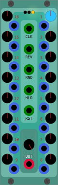

# SlimSeq (working title) 
... is an 8 rack unit wide 16 step sequencer / 16-to-1 sequential switch  

## Details
compact 16 stepper with a few tricks.
concept loosely based on this: [Transient Modules 8s](http://transientmodules.com/8s).  
code based on martin lueders' sequential switch.  

### I/O
CLK clock trigger
REV reverse direction switch
RND random mode switch
HLD hold mode switch
RST reset to zero trigger

16 step inputs

1 main out

### Display/Controls

#### per step
LED - shows selected step (full brightness) and reset position (dimmed)  
  Knob - adjust voltage [-5..5] / attenuvert input signal (if connected)  
Label - click to set reset position (sets current position too, if in hold state or not connected to clock)  

#### center section
LED - shows output level
  Knob - attenuvert output signal

## Changes
__0.5.8__ - initial version  

### Back Story
watched this video: https://www.youtube.com/watch?v=sT-eclbOAqc  
and thought... i want that!  
... with an input on each step.  
... and while we're at it, with 16 steps and some extras (more to come).