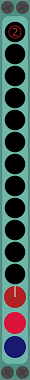

# VUBar 
... is a 2 rack unit wide 12 led signal meter.

## Details

### Display
12 lights, top light is a clip light

### I/O
1 input  
1 through output (unchanged input signal)  

### Controls
__dB interval:__ set with a toggle on the clip led. default mode is 2dB. other options are 1,3,4.  
__Brightness:__ can be adjusted with the red knob.

## Changes  
__0.5.7__ - fixed lights not turning of when unplugging input  
__0.5.6__ - dB interval modes, dim lights, lights: 12  
__0.5.4__ - through output added  
__0.5.1__ - number of lights: 15  
__0.5.0__ - initial version  

### little backstory
My second module. written when vumeter.hpp was added to rack.
and the initial version was just that.
layout and number of lights has changed over versions and i also added a few more options.

episode two:
had to rewrite this, because i wanted better control over the colors to implement other modes etc.  
also wanted to get rid of the knob and use the space for larger lights again.  
found out, you can have transparent controls :)
screencap above shows where i'm at right now. still a bit of stuff left that i want to implement,
but then this'll be reissued as VooBar.
